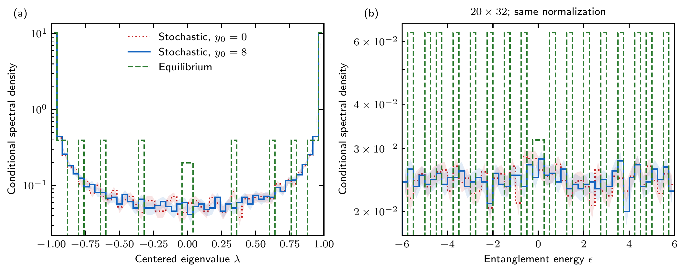
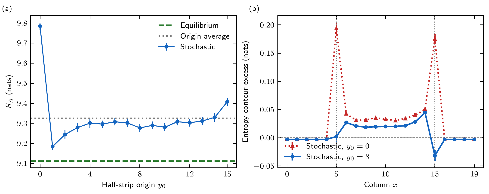
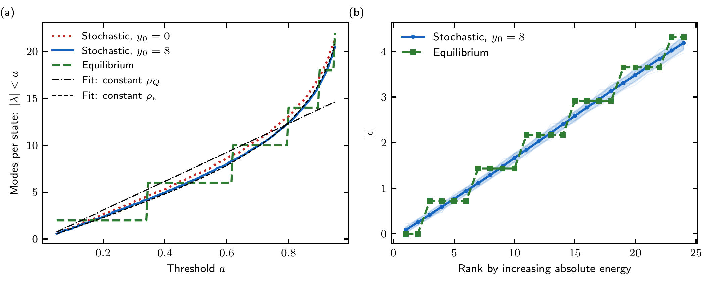
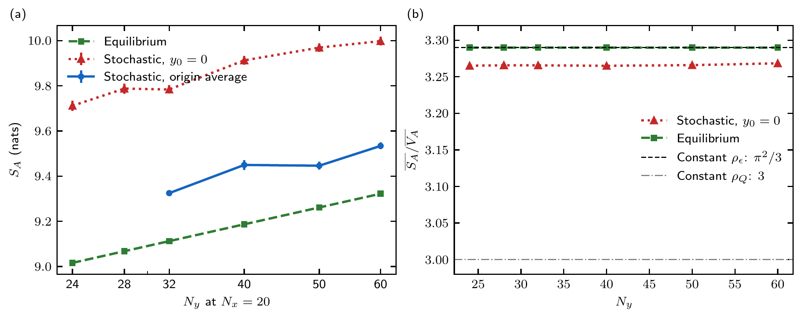
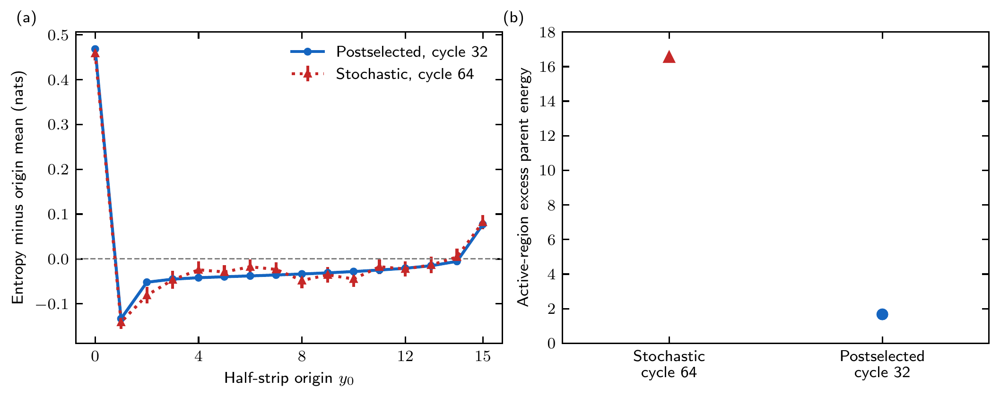

# What distinguishes the stochastic spectra from equilibrium?

The strongest difference is a pronounced **cut-position dependence tied to the ordered measurement protocol**. The data do not support treating the stochastic spectrum as a constant covariance density over its whole interval. Both protocols instead have a broadly similar U-shaped envelope after accounting for the relation between covariance eigenvalues and entanglement energies. The stochastic states have split, shifted levels and a modest residual entropy excess. Their much larger active-region excitation energy is a second, distinct difference.

## Evidence and matching

We compared **600 production trajectories**, 100 at each size 20×24, 20×28, 20×32, 20×40, 20×50 and 20×60, with freshly checked or reconstructed equilibrium benchmarks at the same geometry. Original data were read from campaigns 09 and 14. All 68 production result/receipt pairs were checked for result SHA-256, byte counts, configuration identity, completion and exactly one occurrence of each sample ID per case. Campaigns 09 and 14 record the same canonical GPU engine hash. No stochastic trajectory was rerun.

The common physical settings are hard/support-truncated walls at x=5 and 15, alpha_1=1, alpha_2=30, n_shell=1, trial orbital X, zero twist, Nx=20 and the half strip containing all x and Ny/2 consecutive y rows. Production uses pure initialization, slab-only perfect correction, raster_y and 2Ny cycles. Each equilibrium state fills the lowest half of the overcomplete Wannier (OW) parent Hamiltonian. Its small half-filling gap is resolved at approximately 1.50e-9 for these fixed-width sizes.

The full equilibrium exterior is weakly entangled; the stochastic exterior is an inert product state. We explicitly computed this difference: the equilibrium exterior contributes only **0.02646 nats** to the half-strip entropy. Replacing it by a product gives an active-region equilibrium comparison. Whole-system energy costs are dominated by this preparation mismatch and are **not** used as the physical excitation-energy conclusion below.

## 1. A flat center is compatible with the same U-shaped envelope

Let G denote the occupation correlation matrix and Q_A=2G_A−1 its centered restriction (the previous caches call Q_A the centered covariance G). For occupation nu=(1+lambda)/2,

$$\epsilon=\log\frac{1-\nu}{\nu}=-2\operatorname{arctanh}\lambda,\qquad
\rho_Q(\lambda)=\frac{2\rho_\epsilon(-2\operatorname{arctanh}\lambda)}{1-\lambda^2}.$$

A constant density in entanglement energy therefore gives a U-shaped covariance-density envelope, with a flat expansion near lambda=0. This is a change-of-variable effect, not by itself a phase signature. The density is a discrete spectral measure at finite size; “envelope” here means coarse counts, not an exact continuous distribution.

At 20×32 and y0=8, the bin-free count N(abs(lambda)<a), fitted over 181 thresholds a=0.05...0.95, has RMS residual **0.151 modes** for an arctanh(a) envelope, versus **1.404 modes** for a constant-covariance-density model proportional to a. Both have one fitted amplitude and zero intercept. These are descriptive fits; thresholds and eigenvalues were not treated as independent statistical samples. The same conclusion holds for y0=0 and for origin-averaged counts.

As an independent integrated check, the ratio of mean entropy to mean intrinsic charge variance is **3.26566 ± 0.00070** at y0=0, **3.27377 ± 0.00030** after origin averaging, and **3.28988** in equilibrium. Ideal constant covariance density gives 3; ideal constant entanglement-energy density gives pi²/3=3.28987. This rules out the simplistic globally flat-density description without claiming exact agreement with a universal continuum law.

The conditional histogram excludes abs(lambda)>=1−1e−8 and normalizes each protocol to unit area. Counts and integrals were additionally checked for 20, 50, 100, 200 bins and endpoint tolerances 1e−4, 1e−6, 1e−8, 1e−10 for the original three sizes. Changing this cutoff changes the number of almost-pure modes and hence the density's overall conditional normalization. Entropy, intrinsic variance, and interior cumulative counts avoid that ambiguity.

## 2. The apparent extra wall entropy depends strongly on the cut

At 20×32, 100 trajectories give:

- Original y0=0 cut: **9.78388 ± 0.01841 nats**.
- Translated y0=8 cut: **9.27687 ± 0.01926 nats**.
- Average over all inequivalent origins within each trajectory: **9.32500 ± 0.00959 nats**.
- Equilibrium, independent of origin: **9.11254 nats**.

The paired y0=0 minus y0=8 difference is **0.50700 ± 0.02792 nats**. Translation removes **75.5%** of the original excess; full origin averaging removes **68.4%**. All 16 inequivalent cuts were evaluated for every 20×32 trajectory. Complementary cuts have the same entropy and absolute-spectrum statistics; this does not assert equality of their signed spectra at non-half filling.

The entropy contour locates the effect. At the original cut, the two wall columns together contribute **0.36885 ± 0.01342 nats** of excess. At y0=8, their excess is **−0.02954 ± 0.01443 nats**, while interior topological columns x=6...14 contribute **+0.22034 ± 0.01252 nats**. The contour is an additive decomposition of the full strip entropy, not the entropy of an isolated wall or column.

The end of a raster_y cycle singles out the boundary between the first and last updated rows. The reproducible origin dependence is consistent with that update-order effect. It is not translationally invariant equilibrium behavior. A randomized-order or shifted-start production control would be required to isolate schedule causality completely.

## 3. Level splitting and trajectory averaging explain much of the visual contrast

In the window abs(epsilon)<3, equilibrium has nearly degenerate level pairs: **52.9%** of consecutive gaps are below 1e−5. No such gap occurs in the 100 stochastic y0=8 spectra; their median gap is **0.3572**. Plotting individual trajectories shows that splitting is already present before pooling. Pooling shifted levels then fills the gaps of the equilibrium comb.

The deterministic ordered-postselection control also has split levels. Therefore splitting alone is **not specific to Born randomness**. It distinguishes these finite-cycle circuit states from this equilibrium reference, while averaging accounts for additional visual smoothness.

## 4. The size dependence primarily shows an entropy offset

Entropies in nats; uncertainties are trajectory SEM:

| Size | Stochastic, original cut | Equilibrium | Stochastic, origin averaged |
|---|---:|---:|---:|
| 20×24 | 9.7118 ± 0.0222 | 9.0163 | — |
| 20×28 | 9.7875 ± 0.0225 | 9.0679 | — |
| 20×32 | 9.7839 ± 0.0184 | 9.1125 | 9.3250 ± 0.0096 |
| 20×40 | 9.9125 ± 0.0193 | 9.1871 | 9.4497 ± 0.0215 |
| 20×50 | 9.9691 ± 0.0186 | 9.2615 | 9.4463 ± 0.0174 |
| 20×60 | 9.9978 ± 0.0186 | 9.3223 | 9.5339 ± 0.0150 |

The origin averages use 100 trajectories at Ny=32 and a predetermined 20 trajectories at each larger size (one from every five-sample shard). Origins are averaged within trajectories before estimating SEM. Quarter-system translated cuts were also evaluated for all 100 trajectories at each larger size; the y0=0 excess over those cuts is approximately 0.49–0.53 nats.

A weighted fit S=b+m log Ny over Ny=24...60 gives **m=0.32376 ± 0.02559** for stochastic y0=0 data (chi²=6.64 for 4 degrees of freedom), compared with **m=0.33393** for the equilibrium points. The fixed-origin entropy excess is roughly 0.67–0.73 nats across this range. These data do not resolve a different logarithmic coefficient. The origin-averaged residual also remains positive, about 0.18–0.26 nats over Ny=32...60, with the sampling limits stated above.

## 5. Postselection and excitation energy separate two effects

We checked the saved 20×40 partial-postselection sweep independently. Its late ten-cycle, origin-averaged entropy is **9.41385 ± 0.00612** at forced-target probability p=0 and **9.34013** at p=1. The p=1 result is one deterministic trajectory, not ten independent samples. The sequence across intermediate p is not strictly monotonic within errors. This older campaign uses different preparation/exterior details and only 40 cycles, so it was not pooled with the production endpoint ensemble. Older 16×20 and 16×30 saved covariance histories were also checked as separate finite-cycle controls, with their original walls and initialization retained.

A new canonical CPU control starts from the same prepared active state as production sample 0 and forces all target outcomes. Its **accepted cycle-32** checkpoint has S(y0=0)=9.64340, origin-averaged S=9.17520, and a cut offset of **0.46821 nats**. The stochastic cut offset is 0.45888 nats. Their centered origin profiles have correlation **0.99479**. This demonstrates that the prominent cut pattern can occur without Born randomness. It does not establish the long-time postselected steady state.

The postselected state conserves the initial active-region particle number, **362**, whereas half filling there is 352; the stochastic protocol changes physical charge. Each excitation energy was therefore compared with the minimum active-region OW-parent energy **at that state's own charge**. Stochastic cycle-64 trajectories have excess energy **16.5502 ± 0.2557** in the parent units, while the deterministic cycle-32 control has **1.67416**. The original full-system difference was much larger because of inert-exterior preparation; it is intentionally excluded from this conclusion. The stochastic excess also persists in the 15 trajectories whose active region is exactly half filled: their origin-averaged entropy is **9.32361 ± 0.02278**.

The charge-matched equilibrium reference at active rank 362 has a degenerate Fermi subspace. We sampled 32 pure choices in that two-dimensional subspace; origin-averaged entropy changed by less than 3e−9 among those choices. This is a sensitivity check, not a proof of global extremal bounds. The minimum energy used above is independent of that choice.

An ordered product of noncommuting target-outcome projectors need not prepare the ground state of the Hermitian sum of OW projectors. The deterministic control has a nonzero parent commutator and positive excess energy. Thus the equilibrium “flattened Hamiltonian” ground state and a postselected circuit state should not be treated as interchangeable benchmarks.

## Numerical limits and exclusions

The primary 600-trajectory comparison passed finite-value, spectral-bound, trace, checksum, sample-coverage, and histogram-normalization checks. The 20×32 states were reconstructed from active frame columns; spectra matched the prior cache, frame orthogonality was checked, and entropy-contour and complementary-cut identities closed. At larger sizes, the acquisition observer had already clipped occupations into [0,1]; recorded raw excursions were within roundoff, and spectra were independently reproduced from frames for 20 trajectories per size. No exact endpoint is converted into a finite entanglement energy.

A late-time postselection frame trial amplified initially tiny cross-sector roundoff. A factorized repeat reproduced early results but also encountered inactive-row error later. Those late snapshots are excluded from all accepted physical comparisons. Only the validated checkpoints through cycle 32 are published as the new finite-cycle control. An optional canonical covariance continuation was stopped after a timing check; no conclusion uses it. These attempts and their logs remain available in `exploratory_controls_status.json`. No canonical source file was changed, no numerical acceptance threshold was relaxed, and no late-time leakage is interpreted as physical charge transfer.

The Gaussian entropy reconstructed from the averaged two-point matrix is about **224.08 nats**, versus mean trajectory entropy 9.78 nats at the original cut. This is a different estimator; it is not generally the entropy of the non-Gaussian trajectory mixture and is not used as trajectory entanglement.

## What is established, and what is not

Established: a shared approximate spectral envelope in the correct variable; split levels and ensemble smoothing; a large ordered-cut effect also present under deterministic postselection; a smaller residual entropy excess; and a sizeable active-region excitation-energy difference after charge matching. No distinct universality class, flat covariance-density law, new central charge, or fully converged postselected state is established.

A useful next targeted experiment would hold active charge and initial state fixed while varying schedule order and adding the same within-trajectory origin average. That would isolate the contributions of update order, conditional stochastic outcomes, and charge exchange more sharply than further unqualified histogram overlays.

## Reproduction and outputs

Open `stochastic_equilibrium_comparison.ipynb` for the executed analysis and editable plotting cells. `analyze_comparison.py`, `extend_sizes.py`, and `quantify_findings.py` reproduce the accepted production comparisons and scalar findings; `build_notebook.py` regenerates the notebook. The postselection runner files are explicitly exploratory numerical diagnostics; their late-time attempts are not part of the accepted production result. The accepted finite-cycle data are bound by `accepted_postselection_cycle32.json`.

Tables, raw derived spectra, fit diagnostics, input provenance, vector PDFs, 300-dpi PNGs and the final completion manifest are stored alongside the notebook.

The free-fermion reduced-state and entanglement-energy relation follows [Peschel and Eisler](https://arxiv.org/abs/0906.1663); the connection of entropy and intrinsic charge statistics is discussed in [Song et al.](https://arxiv.org/abs/1008.5191). The numerical conclusions here come from repository data, with the estimator order kept explicit.
