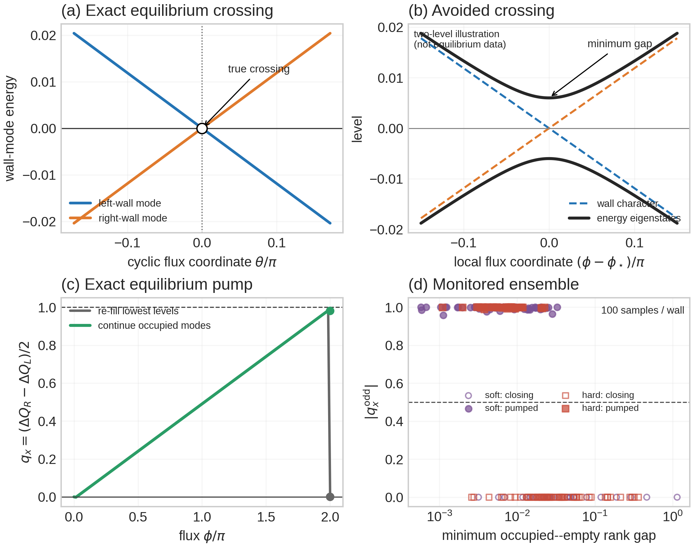

# Exact and avoided wall crossings

This note explains the phrase *ambiguous avoided crossing* in the current
state-projector pump study.  The accompanying figure is generated from saved
equilibrium and monitored-circuit data by
`make_equilibrium_crossing_explainer.py`:

## The exact equilibrium benchmark

The \(20\times40\) flattened-Hamiltonian benchmark has counterpropagating
single-particle modes on the two domain walls.  Panel (a) unwraps the cyclic
flux seam and shows the saved hard-wall modes nearest zero energy.  They meet
at a true crossing.  Because the walls are spatially separated, the two modes
do not appreciably hybridize there.

There are then two different occupation rules:

1. **Instantaneous filling:** at each flux, diagonalize the Hamiltonian and
   occupy the lowest \(R\) eigenvalues.  At the crossing this rule changes
   which wall mode is occupied.  After one flux quantum the Hamiltonian and
   its instantaneous ground-state projector close, so \(q_x(2\pi)=0\).
2. **Continued filling:** start just to one side of the crossing, using the
   signed \(10^{-7}\) regulator, and match the occupied subspace at neighboring
   fluxes by maximum overlap.  This follows mode identity through the energy
   crossing instead of re-filling by energy order.  After the loop this
   continued projector differs from the initial projector by one wall-localized
   particle--hole pair.

Panel (c) displays the actual hard-wall data.  The instantaneous and continued
charges coincide away from the cyclic seam.  At \(2\pi\), instantaneous filling
returns to zero transfer, whereas continuation retains
\(q_x=0.9808096888\).  Reversing the path gives \(-1.0000000016\).  Thus the
nearly integer equilibrium pump is specifically a statement about spectral
flow of a continued occupied subspace, not merely about diagonalizing the
endpoint Hamiltonian.

## What an avoided crossing changes

Panel (b) is an explicitly labelled two-level illustration, not another
equilibrium measurement.  Locally, two wall-character states can be modeled as

\[
H_{\mathrm{2level}}(\delta\phi)
=v\,\delta\phi\,\sigma_z+g\,\sigma_x,
\qquad
E_\pm=\pm\sqrt{v^2\delta\phi^2+|g|^2}.
\]

When \(g=0\), the colored wall-character lines cross exactly.  When \(g\ne0\),
the exact eigenvalues repel and the minimum separation is \(2|g|\).  Across
that narrow region, the energy eigenvectors continuously exchange their wall
character.

This creates two limiting continuations:

- A sufficiently fine flux grid resolves the eigenvector rotation.  Maximum
  overlap then follows the smooth energy eigenstate through the avoided
  crossing.  The rank-\(R\) subspace tends to return to itself: no transported
  particle--hole pair.
- A flux step that jumps across a very narrow avoided crossing has larger
  overlap with the same *wall-character* state on the other side.  The
  algorithm follows the diabatic-looking colored line across the rank
  boundary, leaving one particle--hole pair after the loop: pump-like transfer.

Thus “ambiguous” does not mean that `numpy.linalg.eigh` randomly failed.  It
means that near a narrow avoided crossing, energy ordering and discrete
overlap continuation represent different physical continuation rules, and a
finite flux grid can select between them.

## What the monitored-circuit data say

For each saved monitored endpoint frame \(V\), the pilot constructs

\[
P_0=VV^\dagger,\qquad H_0=I-2P_0,
\]

threads flux through the flattened kernel, diagonalizes \(H(\phi)\), and
compares the instantaneous lowest-\(R\) projector with the overlap-continued
rank-\(R\) projector.  The relevant diagnostic is the instantaneous rank gap

\[
g_R(\phi)=\epsilon_{R+1}(\phi)-\epsilon_R(\phi).
\]

All 200 \(20\times24\) paths attain their minimum gap at
\(|\phi|/\pi=0.9999999682\).  Panel (d) shows that the binary response is tightly
associated with the size of this near-\(\pi\) gap:

- soft wall: pumped median \(g_{\min}=0.00611\), closing median \(0.02652\),
  rank-gap AUC \(0.898\), Spearman correlation with \(|q_x^{\rm odd}|\)
  \(=-0.661\);
- hard wall: pumped median \(g_{\min}=0.00673\), closing median \(0.02624\),
  AUC \(0.911\), Spearman correlation \(=-0.814\).

This strongly validates a **near-crossing mechanism**: samples with a narrower
occupied--empty separation are much more likely to end in the transported
sector.  It does not yet prove that the observed mixture is solely a coarse-grid
artifact.  In particular, pumped soft-wall samples have *better*, not worse,
minimum subspace overlap, and hard-wall overlap does not distinguish the two
classes.  The simple story “the tracker numerically lost the mode” is therefore
not supported.

## Decisive follow-up tests

Two resumable campaigns were launched for the distinction:

1. The \(20\times24\), 128-interval campaign reuses the exact same 200 endpoint
   frames.  If many 64-grid pumped samples close on the finer grid, the binary
   outcome was controlled by under-resolving a narrow avoided crossing.
2. The \(24\times24\), 64-interval campaign increases the transverse wall
   separation.  If the minimum gaps shrink and the pumped fraction rises, that
   supports finite-width wall hybridization as the origin of the avoided gap.

Grid stability and transverse-size scaling are needed before calling the
zero/one split a thermodynamic pump classification.
